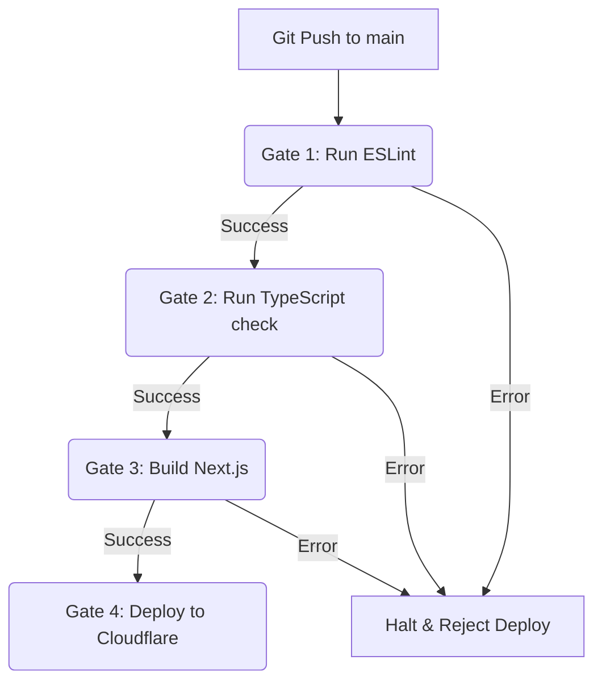

# 8. Deployment Integrity & Build Safety Guidelines

To ensure the storefront remains functional, robust, and free of regression errors, all deployments must undergo validation checks before compilation and release.

## Build Safety Workflow Constraints

The deployment pipeline is configured with three sequential validation gates. A failure at any gate halts the release immediately.

### Gate 1: Syntax & Code Style Checking (ESLint)
* **Command**: `npm run lint`
* **Rule**: Analyzes React code blocks, hooks usage, and syntax formats. If any syntax error (such as unescaped quote structures in text) is discovered, the build halts.

### Gate 2: Compile-Time Type Check (TypeScript)
* **Command**: `npx tsc --noEmit`
* **Rule**: Validates parameters types, interfaces, import segments, and routes parameters. Prevents type errors from reaching runtime.

### Gate 3: Production Next.js Build
* **Command**: `npm run build:cf`
* **Rule**: Compiles static elements and compiles dynamic routes targeting the Cloudflare edge worker runtime.

---

## Restricting Cloudflare Pages Direct Builds

If you want to prevent Cloudflare Pages from deploying code directly on pushes without checking GitHub Actions status:

1. Log in to your **Cloudflare Dashboard**.
2. Navigate to **Workers & Pages** -> **shopinsane**.
3. Go to **Settings** -> **Builds & deployments** -> **Configure/Pause deployments**.
4. Set **Automatic deployments** to **Paused** or **None**.

This guarantees that Cloudflare Page builds only occur via the GitHub Actions runner (wrangler deploy step) after all TypeScript type-check and lint checks have succeeded.
